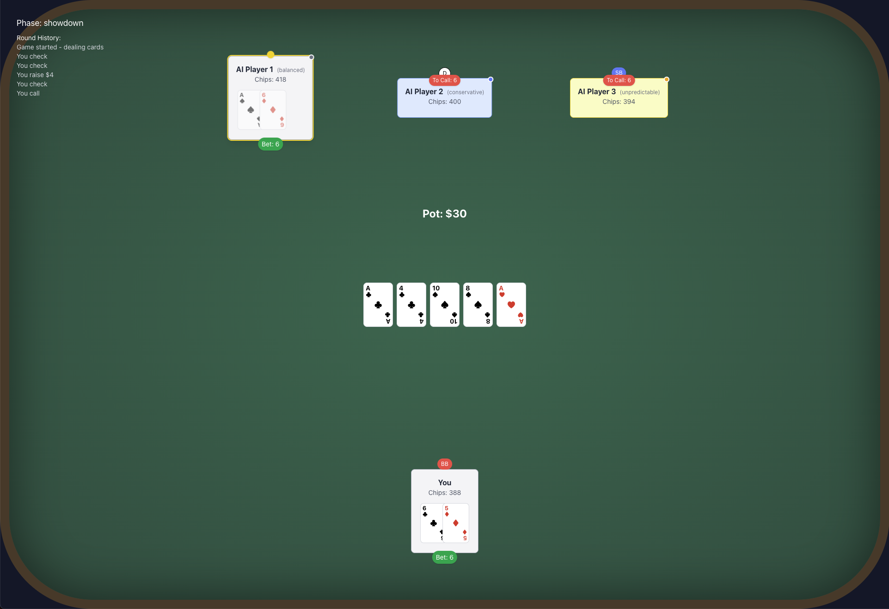

# AI Poker Game

> **Disclaimer**: This project is currently in development and is built for testing purposes only. Features may be incomplete or subject to change. Use at your own discretion.



A Texas Hold'em poker game where you play against AI opponents powered by OpenAI's GPT-4. Each AI player has a unique personality and playing style, making for an engaging and challenging poker experience.

## Features

- Play Texas Hold'em poker against 1-7 AI opponents
- AI players powered by GPT-4 with different personalities and playing styles
- Professional analysis and feedback after each round
- Real-time game state visualization
- Detailed hand evaluation and showdown results
- Responsive design that works on desktop and mobile
- Animated card dealing and chip movements
- Round history tracking
- Betting validation and pot management

## Prerequisites

- Node.js (v14 or higher)
- npm (v6 or higher)
- OpenAI API key

## Setup

1. Clone the repository:
```bash
git clone [repository-url]
cd poker-ai
```

2. Install dependencies:
```bash
npm install
```

3. Start the development server:
```bash
npm start
```

4. Open [http://localhost:3000](http://localhost:3000) in your browser.

## Game Rules

- Each player starts with 400 chips
- Small blind: 1 chip
- Big blind: 2 chips
- Standard Texas Hold'em rules apply
- Players can fold, check, call, or raise
- Game ends when a player loses all chips

## AI Players

The AI players are powered by OpenAI's GPT-4 and have different personalities:
- Aggressive: More likely to raise and bluff
- Conservative: Plays tight, only bets with strong hands
- Balanced: Uses a mix of strategies
- Unpredictable: Randomly changes playing style
- Mathematical: Makes decisions based on pot odds and probabilities

## Game Analysis

After each round, you'll receive:
- Detailed analysis of your gameplay
- Key decision points and their impact
- Suggestions for improvement
- Performance rating
- Strategic advice for future rounds

## Technologies Used

- React
- TypeScript
- Redux Toolkit
- Tailwind CSS
- OpenAI API
- Web Animations API

## Project Structure

```
src/
├── components/         # React components
├── store/             # Redux store and slices
├── services/          # AI player service
├── utils/             # Poker game utilities
└── types/             # TypeScript type definitions
```

## Contributing

1. Fork the repository
2. Create your feature branch (`git checkout -b feature/amazing-feature`)
3. Commit your changes (`git commit -m 'Add amazing feature'`)
4. Push to the branch (`git push origin feature/amazing-feature`)
5. Open a Pull Request

## Environment Variables

Create a `.env` file in the root directory with the following variables:

```
REACT_APP_OPENAI_API_KEY=your_api_key_here
```

## Security Notes

- The OpenAI API key is stored locally in the browser's localStorage
- No game data is stored on any server
- All AI processing is done through secure API calls
- No personal information is collected or stored

## Performance Optimization

- Lazy loading of components
- Memoization of expensive calculations
- Efficient state management with Redux
- Optimized animations using CSS transforms
- Minimal re-renders using React.memo and useMemo

## Browser Support

- Chrome (latest)
- Firefox (latest)
- Safari (latest)
- Edge (latest)

## Known Limitations

- Maximum of 8 players (1 human + 7 AI)
- Requires stable internet connection for AI interactions
- Mobile experience may be limited on smaller screens

## Future Improvements

- Multi-human player support
- Tournament mode
- Hand history export
- Advanced statistics tracking
- Custom AI personality creation
- Offline mode with pre-trained models

## License

This project is licensed under the MIT License - see the LICENSE file for details.

## Acknowledgments

- OpenAI for providing the GPT-4 API
- The React and Redux teams
- The Tailwind CSS team
- All contributors and testers

## Support

For support, please open an issue in the GitHub repository or contact the maintainers.
